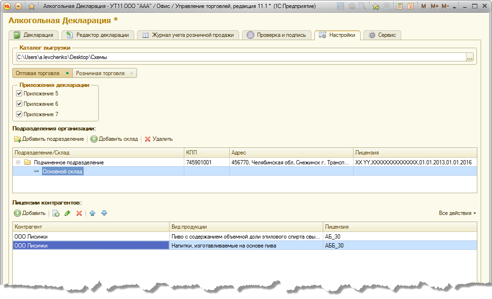

Обзор базовых концепций продукта
================================

.. _главный-вид-продукта:

Главное окно отчета
-------------------

.. figure:: _static/view_1.png

Быстрые настройки
-----------------

Быстрые настройки располагаются в верхней части главного окна отчета (см. параграф :ref:`главный-вид-продукта`) и называются так потому, что потребность в них наиболее высока и требует оперативности в использовании. Общий вид быстрых настроек можно посмотреть на рисунке ниже. 

.. figure:: _static/base_concept_1.png

Остановимся на них подробнее.

* **Организация** - организация - декларант т.е. организация от имени которой будет сформирована алкогольная декларация.
* **Форма отчетности** - Перечисление которое может принимать только одно из следующих значений:
 
 * *Первичная* - используется когда отчет в текущем отчетном периоде еще не подавался в ФС РАР;
 * *Корректирующая* -  отчет содержит исправления текущего или прошлых отчетных периодов. При выборе данного признака становится активным числовое поле справа, обозначающее номер корректировки от 1 до 99.
 
* **Переключатель "В декалитрах/В штуках"** - определяет единицу измерения в которых будут формироваться данные отчетов.  

.. figure:: _static/base_concept_4.png

Базовые настройки
------------------

Отборы
------

