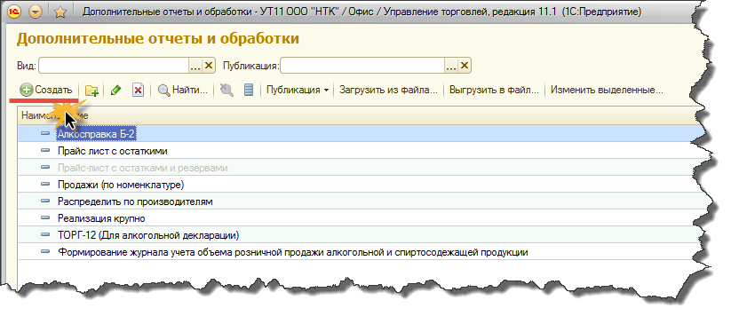

Подготовка продукта к использованию
===================================

Регистрация продукта  в программе "1С:Управление торговлей 8, ред 11.1"
-----------------------------------------------------------------------

Зарегистрировать продукт в конфигурации "1С:Управление торговлей 8, ред 11.1" достаточно просто. Необходимо выполнить несколько шагов в пользовательском режиме 1С:Предприятие, в соответствии с инструкциями ниже по тексту.

#. Перейдем в раздел "Администрирование"

2. В разделе администрирование найдем команду "Печатные формы, отчеты и обработки", выполним её.

.. figure:: _static/reg_2.png

3. В открывшемся окне (см. рисунок ниже) воспользуемся командой "Дополнительные отчеты и обработки" для вызова одноименного справочника. 

.. figure:: _static/reg_3.png

4. Если среди элементов справочника "Дополнительные отчеты и обработки" нет элемента с наименованием "Алкогольная декларация" его нужно создать, нажатием кнопки **"Создать"** на командной панели. Если элемент в справочнике уже есть тогда необходимо выделить его и нажать команду **"Изменить"**. Допустим у нас первый случай - продукта "Алкогольная декларация" в справочнике еще нет.

5. В окне проводника, открывшемся автоматически (поверх диалога редактирования элемента справочника "Дополнительные отчеты и обработки", необходимо перейти в место расположения файла внешней обработки ( с расширением **".epf"**) и выбрать его нажатием кнопки **"Открыть"**.

.. figure:: _static/reg_5.png

6. После того как данные обработки будут загружены в форму элемента справочника "Дополнительные отчеты и обработки" нам необходимо добавить обработку в соответствующий раздел программы - нам кажется наиболее подходящим раздел **"Регламентированный учет"**. Это делается по команде **"Размещение"**

.. figure:: _static/reg_6.png
 
В открывшемся списке выберем раздел программы **"Регламентированный учет"**

.. figure:: _static/reg_7.png

8. В табличной части формы на закладке **"Команды"** назначить пользователей для которых будет доступна алкогольная декларация в режиме быстрого доступа. Это поможет избежать дополнительных действий в интерфейсе каждого пользователя, которым необходимо назначить к использованию внешнюю обработку.

.. figure:: _static/reg_8.png

9. Проверим результат заполнения элемента справочника

.. figure:: _static/reg_9.png

И если все в порядке  жмем кнопку **"Записать и закрыть"**. Далее переходим в раздел **"Регламентированный учет" => "Дополнительные обработки"**

В списке дополнительных обработок должен появиться элемент **"Алкогольная декларация"**. По команде **""Выполнить""** будет произведен запуск продукта.

.. Note::
   Если в окне **"Дополнительные обработки"** не отображается элемент с названием **"Алкогольная декларация"** то это может быть связано с тем, что текущему пользователю не установлен режим быстрого доступа для алкогольной декларации. Это можно исправить не выходя из окна **"Дополнительные обработки"** по команде **"Настроить список"** (в левом нижнем углу окна). 

Обновление продукта до актуальной версии
----------------------------------------

Перед началом использования "Алкогольной декларации для 1С" рекомендуется обновить продукт до последней актуальной версии. Это позволит Вам избежать многих, уже исправленных разработчиком, ошибок, а также актуализировать свои отчеты относительно текущего законодательства.
Разработчиком определено, что обновление не определяется автоматически при каждом запуске "Алкогольной декларации" так как это может замедлять работу системы при некачественном интернет-соединении. Впоследствии это будет усовершенствовано. Поэтому если Вы хотите проверить актуальность Вашей текущей версии необходимо воспользоваться соответствующей командой.

Команда **"Проверить обновления"** находится в правом нижнем углу главного окна программы (см рисунок ниже).  

.. figure:: _static/update_1.png

Вызовем команду **"Проверить обновления"**.

.. Note::
   Перед началом проверки наличия обновлений необходимо авторизоваться на сервере обновлений. Для этого Вы должны ввести правильные авторизационные данные. Чтобы получить логин и пароль для авторизации, необходимо отправить нам сообщение на адрес электронной почты bit@biz-intel.ru с темой "Алкогольная декларация для 1С". В тексте письма необходимо сообщить номер и дату заказа, а также произвольное сообщение, отражающее суть Вашей просьбы.

.. figure:: _static/update_2.png   

Введите логин и пароль в соответствующие поля формы авторизации и нажмите **ОК**. Если у Вас актуальная версия продукта на экране появится соответствующее сообщение

В противном случае Вы будет уведомлены о том что вышла новая версия продукта.

.. figure:: _static/update_3.png

Если Вы согласны продолжить процедуру обновления нажмите **"Да"**.

После завершения процедуры обновления Вы получите сообщение о необходимости перезапуска продукта. Вам будет предложено завершить работу алкогольной декларации. 

Чтобы обновление вступило в силу необходимо согласиться и нажать кнопку **"Да"**. При этом программа закроется и  нужно будет вызвать ее вновь обычным способом. 